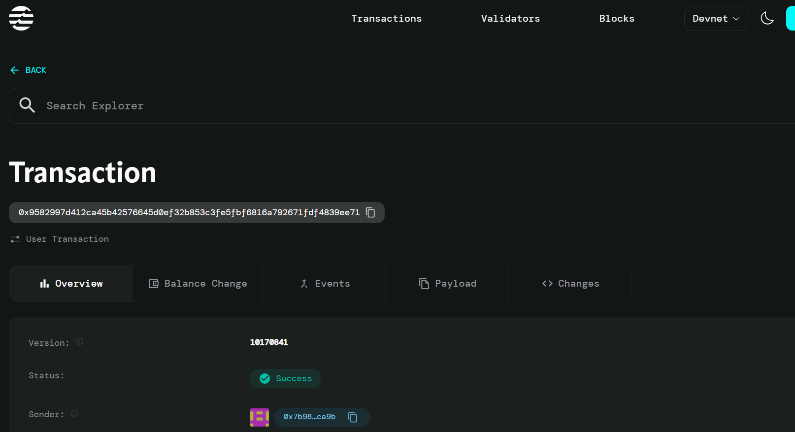

# Proposal Funding

## Project Description

Build automatic funding for approved proposals through a decentralized smart contract system. This project enables users to create funding proposals, manage approval processes, and automatically distribute funds to approved proposals on the Aptos blockchain.

## Project Vision

Our vision is to create a transparent, decentralized, and efficient funding mechanism that eliminates intermediaries and reduces bureaucracy in proposal funding. By leveraging blockchain technology, we aim to build a trustless system where approved proposals receive automatic funding based on predefined criteria and community governance.

The platform empowers communities, organizations, and individuals to:
- Submit funding proposals with clear requirements
- Participate in decentralized decision-making processes
- Ensure automatic and transparent fund distribution
- Create a sustainable ecosystem for innovation and development

## Key Features

### 🚀 **Proposal Creation**
- Simple and intuitive proposal submission process
- Customizable funding amounts and project details
- Immutable proposal records on the blockchain
- Transparent proposer identification

### ✅ **Automatic Funding**
- Smart contract-based automatic fund distribution
- Instant funding upon proposal approval
- Elimination of manual intervention and delays
- Secure fund transfer mechanisms

### 🔒 **Security & Transparency**
- Blockchain-based immutable records
- Transparent funding history and audit trails
- Secure smart contract architecture
- Protection against double funding and fraud

### 🏛️ **Decentralized Governance**
- Community-driven approval processes
- Voting mechanisms for proposal evaluation
- Democratic decision-making framework
- Fair and unbiased proposal assessment

### 💰 **Efficient Fund Management**
- Automated fund allocation and distribution
- Real-time tracking of funding status
- Cost-effective transaction processing
- Multi-currency support (starting with AptosCoin)

## Future Scope

### Phase 1: Enhanced Voting System
- Implement weighted voting mechanisms
- Add voting deadlines and quorum requirements
- Create reputation-based voting power
- Develop anti-spam and sybil attack protection

### Phase 2: Advanced Governance Features
- Multi-tier approval processes
- Category-based proposal classification
- Expert panel reviews for technical proposals
- Integration with external validation services

### Phase 3: Ecosystem Expansion
- Cross-chain compatibility and interoperability
- Integration with other DeFi protocols
- Mobile application development
- API development for third-party integrations

### Phase 4: Analytics & Insights
- Comprehensive dashboard and analytics
- Success rate tracking and metrics
- Predictive analysis for proposal success
- Community engagement statistics

### Phase 5: Enterprise Solutions
- Enterprise-grade proposal management
- Custom governance models for organizations
- Advanced reporting and compliance tools
- Integration with traditional funding systems

## Contract Details
0x9582997d412ca45b42576645d0ef32b853c3fe5fbf6816a792671fdf4839ee71
